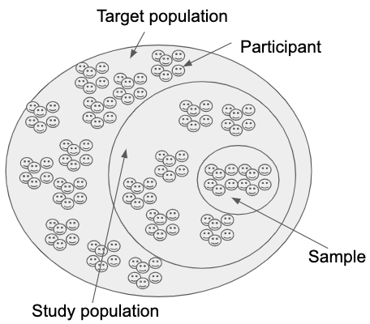

# Sandbox

```{r setup, include=FALSE}
knitr::opts_chunk$set(echo = TRUE)
```

## R Markdown

This is an R Markdown document. Markdown is a simple formatting syntax for authoring HTML, PDF, and MS Word documents. For more details on using R Markdown see <http://rmarkdown.rstudio.com>.

When you click the **Knit** button a document will be generated that includes both content as well as the output of any embedded R code chunks within the document. You can embed an R code chunk like this:

```{r cars}
summary(cars)
```

## Including Plots

You can also embed plots, for example:

```{r pressure, echo=FALSE}
plot(pressure)
```

Note that the `echo = FALSE` parameter was added to the code chunk to prevent printing of the R code that generated the plot.

Once can use weighted kappa to quantify the level of agreement between two raters who observe the same item[@cohenWeightedKappaNominal1968].

The default figure size is 3x3. Because the figure width is small, usually you will be able to put two images side-by-side if you set the chunk option fig.show='hold', e.g.,


```{r, fig.show='hold'}
plot(1:10)
plot(10:1)
```
If you want larger figure sizes you can change the fig_width and fig_height in the document output options or alternatively override the default options on a per-chunk basis.

Opening a dataset:

``
library(readr)
ksb_data01 <- read_csv("http://bit.ly/2uLGLUj", 
    na = "NA")
View(ksb_data01)
``

Adding figures and cross-reference

see Figure \@ref(fig:sam-pop)

```{r sam-pop, out.width='50%', fig.align='center', fig.cap='Samples and Populations', echo=FALSE}

```

## labels and equations

\begin{equation} 
  f\left(k\right) = \binom{n}{k} p^k\left(1-p\right)^{n-k}
  (\#eq:binom)
\end{equation} 
